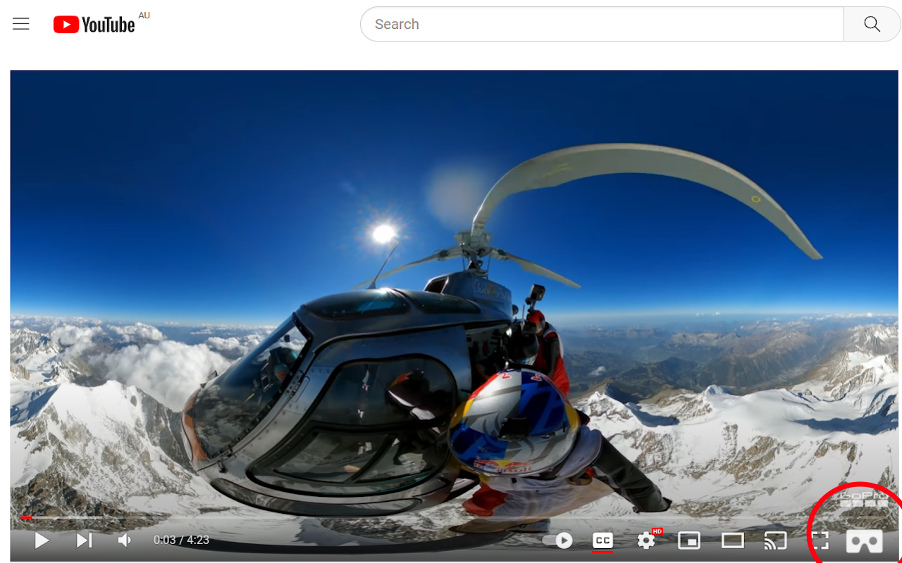

# Enable Youtube PC VR in Chromium

I couldn't find a way to watch Youtube VR videos on the PC without paying?

This is a Chromium extension to enable WebXR on Youtube videos that are non-3D and 360 degrees thanks to https://threejs.org/

### Install Instructions - Easy way - Coming soon?
1. Open the Edge extension store and download "Enable Youtube PC VR in Edge"

### Install Instructions - Manual way
1. Install a Chromium based browser - Chrome, Edge, Brave etc.
2. Download the project from github and unzip it to a folder
3. Open the extensions in the browser and enable developer mode
4. Click "Load Unpacked" and choose the folder

### Usage Instructions
1. Turn VR on first
2. Start a new browser so that it detects the hardware
3. Open a non-3D 360 video on https://www.youtube.com/vr/
4. Click on the white cardboard icon in the bottom right hand corner of the video
5. Click on the "Enter VR" button in the middle bottom of the video
6. Enjoy

### Troubleshooting
Ignore the message from Youtube that says "360° video playback is not supported on this browser."

If the video loads with the directional view buttons hit F5 or the refresh page button - I will make this easier in the future

If it says "VR NOT SUPPPORTED" then the browser hasn't detected your hardware
- Make sure your VR is turned on and calibrated to your room
- Make sure you have given Youtube.com permission to access "Virtual reality" in the "site permissions"
- I have tested this on a HTC Vive Cosmos, please let me know if it works on other hardware configurations - it is generic and should work most devices

If you don't see the white cardboard icon in the bottom right hand corner of the youtube.com video then the extension is not installed or disabled

There isn't much error handling, pull requests welcome